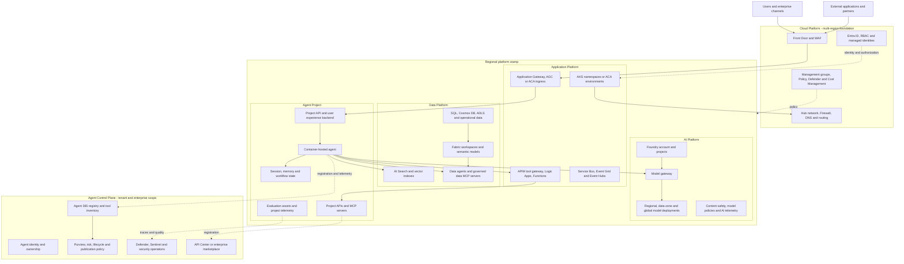
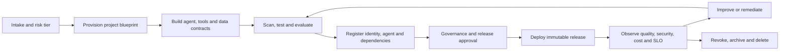

# Enterprise Agent Platform Architecture Concept

**A federated Azure platform for building, scaling, governing and optimizing enterprise agents**

> **Document purpose**
>
> This concept turns the platform vision and capability model into an implementable architecture. It defines six concrete building blocks, their ownership and service contracts, and the functional scenarios that platform and project teams must support. Azure first-party services are the reference implementation; equivalent open-source, marketplace or commercial products can be substituted when they satisfy the same contract and controls.

## 1. Executive summary

The Enterprise Agent Platform is a shared control plane and a set of prepared delivery environments. It allows federated Agent Project teams to build business solutions from approved models, tools, data products, skills and agents without rebuilding cloud foundations, runtime platforms, identity controls, gateways, telemetry or governance for each project.

The architecture is composed of six building blocks:

1. **Cloud Platform** provides the multi-region landing zone, network, identity, policy, security and cost foundation.
2. **Application Platform** provides regional container runtimes, integration services, ingress and workload operations.
3. **AI Platform** provides governed model access, Foundry resources, model routing, safety policies and AI usage telemetry.
4. **Data Platform** provides governed data products, semantic models, search, memory and data agents.
5. **Agent Control Plane** provides agent identity, inventory, policy, publication, risk and security governance.
6. **Agent Project** is the regional delivery boundary in which a project team composes the shared capabilities into a production solution.

The concept adopts the useful lifecycle structure from Google Cloud's Gemini Enterprise Agent Platform: **Build, Scale, Govern and Optimize**. It does not copy Google's product topology. Instead, those four pillars are used as a cross-cutting lifecycle overlay on the six Azure building blocks. This avoids making runtime, governance or quality the responsibility of one product or one team.

The preferred runtime for custom agents and MCP servers is a container hosted on Azure Kubernetes Service (AKS) or Azure Container Apps (ACA). Model deployments can reside in several Azure regions and are hidden behind a stable model gateway contract. Private connectivity and managed identity are the defaults. Public exposure is limited to controlled user and partner channels. Agent publication, evaluation evidence, observability and cost attribution are lifecycle requirements rather than post-production additions.

**Terminology.** The planning input calls the fifth building block the **Agent Platform**. This concept uses **Agent Control Plane** to distinguish that governance and inventory block from the complete Enterprise Agent Platform described by this document. The Agent Governance team is accountable for its policy and publication processes; control-plane engineering and operations can be performed by a dedicated team or a joint team drawn from Entra, security and platform engineering.

## 2. Scope and outcomes

### 2.1 In scope

- Multi-region platform foundations with regional workload execution.
- Regional AKS and ACA runtime patterns for custom agents, APIs and MCP servers.
- Governed model access through Azure API Management (APIM) AI gateway capabilities and one or more Microsoft Foundry accounts.
- Structured and unstructured grounding through Microsoft Fabric, Azure AI Search, databases, storage, semantic models, ontologies and data agents.
- Agent and MCP identity, inventory, publication and security governance through Microsoft Entra, Microsoft Defender, Microsoft Purview and Microsoft Agent 365 capabilities where available.
- Private network integration, user-facing ingress, workload identity and authorization propagation.
- Agent evaluation, observability, operational support, cost attribution and lifecycle automation.
- A repeatable Agent Project onboarding blueprint and functional implementation scenarios.

### 2.2 Out of scope

- A mandate for one agent SDK, orchestration framework or user-interface technology.
- Foundry prompt agents as the default runtime for workloads requiring direct private network access. Their use can be evaluated separately when their networking and hosting characteristics satisfy the project requirements.
- Replacement of existing enterprise API, data, cloud or application platforms.
- Unrestricted autonomous write access to enterprise systems.
- A claim that every Google platform feature has an exact Azure product equivalent.

### 2.3 Target outcomes

- A project receives a usable environment, identities, model contract, telemetry and deployment path rather than an empty subscription.
- Platform controls are implemented once and inherited by projects.
- Each model call, tool call and state-changing action is attributable to a user, workload and agent.
- Shared agents, tools and MCP servers are discoverable, owned, versioned and governed.
- Quality, safety, cost and operational evidence are available before and after production release.
- A model, runtime or implementation product can be replaced without changing the platform's logical contracts.

## 3. Adaptation of the Google lifecycle concept

Google presents its agent platform around four pillars: Build, Scale, Govern and Optimize. The separation is useful because it treats agent delivery as a full lifecycle and gives identity, gateways, registry, memory, evaluation and observability first-class status. This architecture adopts that separation while distributing implementation responsibility across the Azure platform blocks.

| Lifecycle pillar | Intent adopted in this concept | Azure implementation emphasis | Primary building blocks |
| --- | --- | --- | --- |
| Build | Give teams reusable frameworks, models, data grounding, templates and development environments. | GitHub or Azure DevOps templates, Microsoft Foundry projects, approved SDKs, model catalogue, Fabric data products, AI Search, API and MCP catalogue. | Agent Project, AI Platform, Data Platform, Application Platform |
| Scale | Run stateful and long-running agents reliably, including sessions, memory and isolated code execution where required. | AKS or ACA, Durable Functions or Logic Apps, Service Bus, project-owned state stores, Redis, Cosmos DB, AI Search and isolated ACA jobs or sandboxes. | Application Platform, Agent Project, Data Platform |
| Govern | Assign identity, catalogue assets, mediate tool calls, enforce policy and detect threats. | Entra workload identities, Agent 365, APIM, API Center, Azure Policy, Defender, Purview, Content Safety and human approval controls. | Agent Control Plane, Cloud Platform, AI Platform, Application Platform |
| Optimize | Evaluate behavior, trace execution, monitor production quality and improve prompts, tools and routing. | Foundry evaluations, project test harnesses, OpenTelemetry, Application Insights, Azure Monitor, Log Analytics, dashboards and CI/CD quality gates. | Agent Project, AI Platform, Agent Control Plane |

This mapping is an architectural analogy, not a product equivalence statement. In particular:

- Google's Agent Runtime maps to an Azure runtime pattern composed from AKS or ACA plus state, messaging, identity and telemetry services.
- Google's Agent Gateway pattern maps to governed tool and agent invocation through APIM, identity-aware authorization and runtime policy. It is distinct from the model gateway even when both use APIM.
- Google's Agent Registry pattern maps to Agent 365 and, where needed, API Center or an internal catalogue. The registry is the system of record; a marketplace or developer portal is the consumption experience.
- Google's Sessions and Memory Bank patterns map to project-scoped session and memory services with explicit retention, isolation and deletion rules.
- Google's evaluation and trace concepts map to evaluation pipelines and end-to-end OpenTelemetry correlation across user, agent, model, tool and workflow boundaries.

## 4. Architecture principles and assumptions

### 4.1 Principles

1. **Centralize systemic controls and federate solution delivery.** Identity policy, model mediation, registry, network baselines, security signals and minimum telemetry are central. Business logic, prompts, tools, user experience and project evaluation remain with the Agent Project team.
2. **Treat every agent as a workload identity.** Human identity, agent identity and runtime identity are related but not interchangeable. Authorization decisions must identify the actor, the agent and the requested resource.
3. **Separate model, agent and tool gateways logically.** They may share APIM infrastructure, but they have different policies, owners, scaling profiles and audit requirements.
4. **Keep business process state out of prompts.** Durable process state, approvals, retries and compensating actions belong in workflow and state services.
5. **Use private connectivity by default.** Public ingress is deliberate, authenticated and protected; platform-to-platform traffic stays on private enterprise paths where supported.
6. **Deny static keys where managed identity is supported.** Credentials that remain necessary are stored in Key Vault, rotated and never embedded in code or agent instructions.
7. **Make write actions explicit.** Read tools and transaction tools use different scopes, policies and approval requirements. High-impact writes require deterministic validation and, where appropriate, human confirmation.
8. **Evaluate the system, not only the model.** Acceptance covers retrieval, reasoning, tool selection, authorization, workflow outcome, latency, cost and safety.
9. **Design regional workloads for failure.** A regional project remains the default, but dependencies have declared failover, degradation and recovery behavior.
10. **Automate registration and evidence.** Deployment pipelines update inventory and attach evaluation, security and operational evidence to the released version.

### 4.2 Assumptions

- The Cloud Platform spans multiple Azure regions; an Agent Project is regional unless its business continuity tier requires a second deployment.
- Model deployments can be global, data-zone or regional and can use provisioned or consumption capacity. The model gateway hides deployment location and capacity selection from consumers.
- Custom applications, agents and MCP servers run as containers on AKS or ACA.
- Hub-and-spoke networking is established. Shared DNS, inspection and egress controls reside in the hub; Application, AI and Data Platforms use spokes.
- Agent Project resources are placed in a dedicated subscription or resource group with delegated permissions and inherited policy.
- User interfaces can be custom web or mobile applications, Teams applications or Copilot agents. Internet-facing channels terminate at approved edge and ingress services.
- User-assigned managed identities and workload identity federation are pre-provisioned where practical.
- Agent 365 and related registry features are used subject to tenant availability, licensing and product maturity. The logical registry and identity requirements remain mandatory even when an interim implementation is required.
- The reference design is an internal enterprise platform in one Entra tenant, shared across business domains with project-level isolation. Building a customer-facing, multi-tenant SaaS control plane or accepting identities from other tenants requires a separate tenant-isolation design.
- The default identity unit is one workload identity per registered agent and environment. Replicas of that deployment share the identity; unrelated agents do not. A registry record can map to separate development, test and production identities, while the release manifest and trace identify the exact deployed version.

## 5. Logical architecture

Solid arrows in the diagram represent runtime request or data paths. Dotted arrows represent policy, identity, registration or evidence flows. Resource-management operations are intentionally omitted from the runtime paths.

### 5.1 Architectural planes

The building blocks participate in four logical planes:

| Plane | Purpose | Examples |
| --- | --- | --- |
| Experience plane | Presents agents and workflows to users and applications. | Web and mobile applications, Teams, Copilot agents, APIs and approval experiences. |
| Execution plane | Runs agent reasoning, workflow, memory, retrieval and tool invocation. | AKS, ACA, Functions, Logic Apps, Service Bus, AI Search, Redis and Cosmos DB. |
| Control plane | Provisions, registers, authorizes, configures and governs resources and digital actors. | Azure Resource Manager, Entra, Azure Policy, Foundry projects, Agent 365, API Center and CI/CD. |
| Evidence plane | Correlates operations, security, quality and cost across the lifecycle. | OpenTelemetry, Application Insights, Log Analytics, Foundry evaluations, Defender, Sentinel and cost exports. |

User requests flow through the experience and execution planes. Deployment and governance actions flow through the control plane. Every plane emits evidence. Administrative control-plane endpoints must not become an alternate path for runtime traffic.

## 6. Building blocks

### 6.1 Cloud Platform

**Purpose.** The Cloud Platform provides the enterprise Azure foundation and enforces controls that must be consistent across every region and workload.

| Sub-building block | Reference implementation | Implementation guidance | Service contract to projects |
| --- | --- | --- | --- |
| Tenant and hierarchy | Entra tenant, management groups, subscriptions and resource groups | Separate platform, connectivity, identity and workload subscriptions. Place Agent Projects under a policy-bearing workload management group. | Approved subscription or resource group with named owner, environment and cost centre. |
| Network topology | Virtual WAN or hub VNets, spoke VNets, peering, Private Link and Private DNS | Deploy a hub per supported geography or region. Centralize DNS forwarding, inspection and egress. Delegate project subnets without delegating hub control. | Routable project subnets, private DNS resolution and declared ingress/egress paths. |
| Identity foundation | Entra groups, managed identities, workload identity federation, PIM and access reviews | Use groups for human access and managed identities for workloads. Require PIM for privileged roles and automate periodic reviews. | Project groups and identities with least-privilege assignments and accountable owners. |
| Policy and security baseline | Azure Policy, Defender for Cloud, Key Vault and resource locks | Deny public access and local authentication where supported; require diagnostic settings, TLS, approved regions, tags and private endpoints. Use audit before deny when onboarding legacy services. | Inherited guardrails, exception process and compliance status. |
| Cost and resource governance | Cost Management, budgets, tags and Resource Graph | Require project, environment, owner, data classification and cost-centre metadata. Export cost and usage centrally. | Budget, alert recipients and project-level cost views. |
| Resilience foundation | Availability Zones, paired or selected secondary regions and backup policies | Define platform recovery tiers and test DNS, gateway, identity and secret dependencies, not only workload compute. | Published availability, recovery and regional dependency commitments. |

**Ownership boundary.** The Cloud Platform team owns the hierarchy, hub, policy definitions and identity foundation. Other platform teams own their spoke resources and must comply with the inherited controls. Agent Project teams do not receive permissions to alter enterprise policy, hub routing or shared DNS.

### 6.2 Application Platform

**Purpose.** The Application Platform supplies regional execution and integration services for containerized agents, MCP servers, APIs and supporting workflows.

| Sub-building block | Reference implementation | Implementation guidance | Service contract to projects |
| --- | --- | --- | --- |
| Container runtime | AKS or ACA | Offer standard shared and dedicated tenancy tiers. Enable zone resilience, autoscaling, image provenance, workload identity, private networking and diagnostic export. | Namespace, ACA environment or dedicated runtime with quotas, identity and deployment endpoint. |
| Image supply chain | Azure Container Registry, GitHub Advanced Security or Defender for DevOps | Use private image pull, immutable release tags or digests, vulnerability scanning and admission controls. | Approved repository, image naming convention and release evidence requirements. |
| Ingress | Front Door, WAF, Application Gateway, Application Gateway for Containers or ACA ingress | Terminate public traffic only at approved edge services. Re-authenticate or preserve verified identity at the application boundary. | Private service endpoint by default; approved public hostname where required. |
| API and tool gateway | APIM and API Center | Use a logically separate gateway domain for APIs, MCP servers and agent endpoints. Validate tokens, apply quotas, restrict methods and log tool identity and result class. | Versioned API or MCP publication process and stable consumer endpoint. |
| Workflow and messaging | Logic Apps, Durable Functions, Functions, Service Bus, Event Grid and Event Hubs | Use durable orchestration for retries, approvals and long-running processes. Use queues to isolate agent latency from downstream systems. | Standard event, queue and workflow patterns with dead-letter and replay procedures. |
| Runtime operations | Azure Monitor managed service for Prometheus, Managed Grafana, Application Insights and Log Analytics | Provide platform health and project-scoped telemetry views. Preserve trace context through gateways, queues and workflows. | SLO dashboard, logs, traces, alerts and support runbook. |

**AKS versus ACA selection.** ACA is the default for stateless APIs, MCP servers, event-driven workers and agents that do not need Kubernetes-specific controls. AKS is selected when a project requires advanced network policy, custom operators, specialized scheduling, service mesh, extensive sidecars, high tenancy control or an established Kubernetes operating model. Dedicated environments are justified by regulated isolation, unusual scale, custom platform components or independent lifecycle requirements, not merely team preference.

### 6.3 AI Platform

**Purpose.** The AI Platform gives projects governed, stable and observable access to approved models and AI services while retaining central control of deployment, capacity and lifecycle.

| Sub-building block | Reference implementation | Implementation guidance | Service contract to projects |
| --- | --- | --- | --- |
| Model catalogue | Microsoft Foundry model catalogue plus enterprise approval metadata | Publish approved model families, versions, data-processing constraints, regions, quotas, retirement dates and intended uses. | Discoverable model contract and supported usage profile. |
| Model deployment | Foundry accounts and model deployments | Place deployments according to data residency, capacity and resilience requirements. Separate production capacity from experimentation. | Stable logical deployment name without exposing regional topology. |
| Model gateway | APIM AI gateway capabilities | Authenticate with Entra, route by policy, enforce quotas, collect token metrics, apply retry and circuit-breaker rules and support controlled fallback. Do not silently switch to a model with materially different safety or data characteristics. | Private endpoint, audience, logical model name, quota and SLO. |
| AI safety | Azure AI Content Safety, gateway policy and project-level safeguards | Apply baseline input/output controls centrally. Projects add scenario-specific validation. Record policy version with each trace. | Minimum safety policy and exception/escalation process. |
| Foundry project services | Foundry projects, evaluations and connections | Delegate project-level development while retaining account and shared connection ownership. Register project metadata during provisioning. | Project workspace, roles, approved connections and evaluation destination. |
| AI usage evidence | Gateway telemetry, Foundry telemetry, Application Insights and cost exports | Attribute model usage to project, environment, agent, user or channel where permitted. Avoid logging sensitive prompt content by default. | Usage, latency, errors, safety events and cost allocation data. |

**Multi-region model routing.** The gateway uses backend pools for approved deployments. Routing considers deployment health, quota, residency and the model contract. A fallback is permitted only when it preserves the declared model family or an explicitly accepted compatibility class. The caller receives a correlation identifier and the resolved model version is recorded in telemetry. Region or provider selection is not delegated to prompt logic.

The AI Platform team owns catalogue publication and technical lifecycle. Security, privacy and responsible-AI stakeholders approve the model's permitted data and risk profile; Data Governance approves residency constraints; FinOps approves exceptional capacity commitments. A project requesting a model outside the catalogue supplies the use case and evaluation evidence but does not deploy it directly into the shared production account.

A **compatibility class** is an approved set of deployments with equivalent API contract, modality, context minimum, residency class, safety baseline and tested task behavior. Same-region replicas of the same model version are direct equivalents. A different version or model is compatible only after project regression tests meet the declared quality, latency and cost tolerances. The AI Platform records compatible backend identifiers and approval evidence as gateway configuration; gateway policy never infers compatibility from a similar product name.

### 6.4 Data Platform

**Purpose.** The Data Platform makes trusted data, semantic meaning and grounding services consumable without creating unmanaged point-to-point access.

| Sub-building block | Reference implementation | Implementation guidance | Service contract to projects |
| --- | --- | --- | --- |
| Analytical data products | Fabric, OneLake and governed workspaces | Publish owned data products with contracts, classification, lineage, freshness and access policy. | Governed workspace, SQL/API endpoint or data-agent interface. |
| Semantic foundation | Fabric semantic models, Purview glossary, ontologies and graph stores | Reuse business definitions across analytics and agents. Version semantic assets and assign business owners. | Named concepts, metrics, relationships and compatibility version. |
| Retrieval and vector services | Azure AI Search | Separate indexes by security and lifecycle boundary. Enforce document-level authorization when required and retain source metadata for citations. | Search endpoint, index contract, freshness target and authorization behavior. |
| Operational stores | Azure SQL, Cosmos DB, ADLS and approved databases | Access through managed identity and private endpoints. Separate agent memory from systems of record. | Data contract, transaction semantics and recovery commitments. |
| Session and memory | Redis, Cosmos DB, SQL or AI Search | Separate ephemeral session state, durable workflow state and long-term semantic memory. Apply purpose, consent, retention and deletion rules to each. | Scoped state store with maximum retention and deletion API. |
| Data agents and data MCP | Fabric data agents or container-hosted governed MCP servers | Prefer read-only, bounded semantic operations. Expose writes through explicit transactional APIs rather than unrestricted query tools. | Versioned tool schema, authorization scopes, output classification and SLO. |

**Ownership boundary.** The Data Platform team owns enterprise data products and semantic standards. An Agent Project can own project indexes, memory and operational state, but those resources remain subject to platform classification, lineage, retention, identity and network controls.

**State-store selection.** Use Redis for low-latency, replaceable session context with short expiry. Use Cosmos DB when durable JSON state, elastic scale or multi-region availability is required. Use SQL when transactions, relational constraints and auditable workflow state dominate. Use AI Search for derived semantic memory that is retrieved by meaning, not as the authoritative record. Durable Functions or Logic Apps own workflow progression; their state must not be reconstructed from conversational memory. A project can combine these stores, but each datum has one authoritative store and one retention class.

### 6.5 Agent Control Plane

**Purpose.** The Agent Control Plane makes the enterprise agent estate identifiable, discoverable, governable and auditable across runtime products and project boundaries.

| Sub-building block | Reference implementation | Implementation guidance | Service contract to projects |
| --- | --- | --- | --- |
| Agent inventory | Agent 365 registry; interim enterprise registry if required | Register production and shared agents with immutable version, runtime URI, owner, sponsor, risk, data classes, dependencies and lifecycle state. | Agent identifier and publication status. |
| Tool and MCP inventory | Agent 365 tool registry, API Center or internal catalogue | Register callable tools and MCP servers, including operation risk, auth mode, scopes, owner, schema version and consumers. | Discoverable endpoint and onboarding instructions. |
| Agent identity | Agent Identity Blueprint, Entra applications, managed identities and agent users as applicable | Give each deployed agent instance or controlled class a unique identity. Link runtime identity to registered agent metadata. | Identity issuance, credentialless token flow and revocation path. |
| Runtime policy | Entra authorization, Conditional Access where applicable, APIM policy and application authorization | Evaluate caller, agent, tool, operation and context. Do not rely on model reasoning to enforce access. | Policy decision and auditable denial reason. |
| Governance and publication | Purview, risk workflow and Agent 365 governance | Require owner, sponsor, evaluation, threat model, data classification, support and retirement metadata before production publication. | Review outcome, conditions and expiry date. |
| Threat operations | Defender, Sentinel and security telemetry | Correlate suspicious prompts, anomalous tool use, identity events and resource access. Provide containment actions for identity, gateway and runtime. | Alert route, incident runbook and emergency revocation. |

**Registration threshold.** Every production agent is inventoried. Agents or MCP servers intended for reuse are additionally published to the enterprise catalogue. Internal helper components can remain undiscoverable to general consumers, but they still appear as dependencies of their owning agent.

Each registry record holds one logical agent identifier and version history. Environment bindings map that record to the corresponding Entra or managed identity, runtime endpoint and deployment version. Disabling a registry record removes discovery but is not a security boundary. Containment separately disables the affected identity, gateway route or deployment. Routine identity replacement updates the environment binding without changing the logical agent identifier.

### 6.6 Agent Project

**Purpose.** The Agent Project is the accountable delivery unit for a business outcome. It composes shared platform services and owns workload behavior through production.

| Sub-building block | Project responsibility | Typical Azure resources |
| --- | --- | --- |
| Experience and API | Implement channel-specific experience, authentication, conversation controls and user handoff. | Web app, Teams or Copilot integration, API container and ingress configuration. |
| Agent runtime | Implement reasoning, orchestration, tool selection, prompt and policy-aware behavior. | Agent container on AKS or ACA and an approved agent framework. |
| Tools and MCP servers | Implement bounded capabilities with deterministic validation and explicit authorization. | MCP or API containers, APIM publication and workload identities. |
| Project knowledge | Prepare project-owned retrieval, indexing, memory and state under data governance. | AI Search, Redis, Cosmos DB, SQL or storage. |
| Workflow | Implement durable state, approvals, retries and business transaction boundaries. | Logic Apps, Durable Functions, Functions and Service Bus. |
| Quality and operations | Own evaluation datasets, release thresholds, SLOs, dashboards, alerts and runbooks. | Foundry evaluations, test harness, Application Insights and Log Analytics. |
| Delivery automation | Build, scan, deploy, register and promote immutable releases. | GitHub Actions or Azure Pipelines, Bicep or Terraform and deployment environments. |

The project team controls its code and configuration but cannot alter central model deployments, enterprise gateways, registry policy, hub networking or inherited policy. Production support remains shared: the project owns application behavior; platform teams own their service commitments.

## 7. Agent Project deployment blueprint

### 7.1 Provisioned project package

Each project onboarding produces a machine-readable manifest and the following minimum package:

- A subscription or resource group in the correct management group and region.
- A delegated subnet or approved shared-runtime tenancy with private DNS resolution.
- Developer, operator and reader groups with PIM and access-review configuration.
- Separate runtime and deployment managed identities; additional tool identities where risk separation requires them.
- An AKS namespace, ACA environment or dedicated runtime selected through workload classification.
- A private model gateway endpoint, Entra audience, approved logical models, quotas and support SLO.
- A Foundry project and project-scoped roles where Foundry capabilities are used.
- Project Key Vault, telemetry destination and required diagnostic settings.
- Approved access to data products, search indexes and messaging endpoints.
- CI/CD environments, policy checks, image repository and deployment template.
- Draft agent and dependency records in the enterprise inventory.
- Budget, mandatory tags, alert recipients and service ownership metadata.

### 7.2 Environment model

Development, test and production are separate authorization and configuration boundaries. Production uses different managed identities and data permissions from non-production. Production data must not be copied into lower environments without an approved masking or synthetic-data process. Promotion moves an immutable image and versioned configuration; it does not rebuild code differently for each environment.

### 7.3 Workload tiers

| Tier | Suitable workloads | Runtime and resilience | Governance requirement |
| --- | --- | --- | --- |
| Tier 0: Experiment | Time-limited prototypes with synthetic or low-risk data and no business action. | Shared non-production ACA or sandbox; no availability commitment. | Named owner, expiry, approved models and no production credentials. |
| Tier 1: Internal assistant | Read-oriented employee scenarios with low business impact. | Shared regional ACA or AKS namespace; standard backup and support. | Inventory, evaluation baseline, data classification and operational owner. |
| Tier 2: Business workflow | Agents that influence or execute bounded business processes. | Zone-resilient runtime, durable workflow, queue isolation and tested recovery. | Threat model, transaction controls, approval policy, release gate and on-call runbook. |
| Tier 3: Critical or regulated | Material financial, safety, legal or customer impact. | Dedicated or strongly isolated runtime, secondary-region strategy and tested failover. | Independent risk approval, comprehensive audit, red-team evidence and recurring control review. |

Tier 0 uses an expedited lifecycle: automated intake, a pre-approved sandbox, approved models and synthetic or low-risk data, basic telemetry, named owner and enforced expiry. It is inventoried as an experiment but is not published to the enterprise agent catalogue. Promotion to Tier 1 or above starts the full provisioning, evaluation, registration and approval path; a Tier 0 deployment is never promoted in place or given production credentials.

## 8. Identity, authorization and trust

### 8.1 Identity chain

A request can contain three relevant identities:

1. **User or calling application identity** identifies who initiated the request.
2. **Agent identity** identifies the registered digital actor making a decision or invoking a capability.
3. **Runtime or tool identity** identifies the deployed workload obtaining an Azure token.

The system must preserve the relationship between all three in trace and audit records. A runtime identity must not imply unlimited authority for every agent hosted on that runtime.

### 8.2 Authorization patterns

| Scenario | Preferred pattern | Constraint |
| --- | --- | --- |
| Service-level model access | Managed identity to the model gateway | The gateway authorizes project and logical model; no model keys. |
| User-specific data retrieval | On-behalf-of or delegated authorization where supported | The user context is validated at the data/tool boundary, not accepted from prompt text. |
| Background processing | Agent or workload application permission | Scope is bounded to the job and data domain; no reuse of a human token. |
| Agent-to-agent call | Calling agent identity plus registered target policy | The target validates caller identity, allowed capability and tenant context. |
| Read tool | Scoped application or delegated permission | Tool returns only data permitted for the effective identity. |
| Write tool | Dedicated transaction scope and deterministic policy | Confirmation or approval is required according to action risk. Idempotency and audit are mandatory. |
| Emergency containment | Disable agent identity, gateway route or deployment | Revocation must work without changing agent code. |

Foundry account-level roles remain with the AI Platform team. Project leads receive Foundry Project Manager only where needed; developers receive Foundry User; runtime or application consumers receive Foundry Agent Consumer where endpoint interaction is the only requirement.

## 9. Network and gateway design

### 9.1 Regional topology

Each supported region has an Application Platform spoke and, where required, AI and Data Platform spokes. Agent Projects use a project spoke or delegated subnets in a platform spoke. Private endpoints are resolved through centrally linked private DNS zones. Shared outbound traffic follows hub inspection and egress policy. East-west traffic is explicitly routed and authorized; VNet connectivity alone does not grant application access.

### 9.2 Gateway separation

| Gateway domain | Traffic | Core policies | Owner |
| --- | --- | --- | --- |
| Experience ingress | Internet or enterprise user to project application | WAF, DDoS protection, TLS, user authentication, rate limits and regional routing. | Cloud and Application Platform teams |
| Model gateway | Agent or application to approved model | Workload authentication, model authorization, quota, token limits, safety, routing, fallback and usage attribution. | AI Platform team |
| Tool and MCP gateway | Agent to API, MCP server or agent endpoint | Caller and agent authorization, operation allow-list, schema and payload controls, risk-specific throttling and audit. | API Management/Gateway team with Agent Governance |
| Data access endpoint | Agent or tool to data product | Effective identity, row/document authorization, classification and query limits. | Data Platform team |

The same APIM deployment can host more than one gateway domain for an initial implementation, but products, policy fragments, hostnames, telemetry dimensions and administrative ownership must remain separable. High-scale or high-risk domains should move to dedicated instances when capacity, blast radius or change cadence demands it.

## 10. Functional implementation scenarios

### 10.1 Scenario A: Onboard an Agent Project

**Trigger.** An approved business use case needs a development and production path.

**Implementation flow.** The project submits owner, sponsor, business outcome, data classes, target users, regions, expected usage, required tools and preliminary risk tier. An automated workflow creates the project hierarchy, network attachment, groups, identities, runtime tenancy, Foundry project, model access, telemetry, budget and draft inventory record. Platform owners approve only exceptions and privileged access. The pipeline validates that every provisioned resource has ownership, diagnostics, private access and cost metadata.

**Control points.** Risk tier selects runtime isolation, evaluation depth, write-action policy and resilience pattern. Production credentials and data permissions are not granted to non-production identities.

**Acceptance evidence.** A deployment identity can release a sample container; its runtime identity can call only the approved logical model; private DNS resolves required endpoints; telemetry contains the project and environment identifiers; policy reports no unapproved exception; the inventory record links to the owning repository and support contact.

### 10.2 Scenario B: Build and run a grounded read-only agent

**Trigger.** An employee asks a question that requires approved enterprise knowledge.

**Implementation flow.** The channel authenticates the user and sends the request to the project API. The API starts a trace and invokes the agent. The agent calls the model gateway, which resolves an approved deployment. When grounding is needed, the agent calls a read-only retrieval tool through the tool gateway. The retrieval service evaluates the effective user or project scope, queries AI Search or a governed data product, and returns bounded results with source identifiers. The agent generates an answer with citations and the response passes scenario-specific output validation.

**Control points.** Retrieved content is treated as untrusted data, not instructions. Document-level access is enforced by the retrieval service. The model receives only the minimum required context. Sensitive prompt or document content is not placed in default logs.

**Acceptance evidence.** Evaluation demonstrates retrieval relevance, groundedness, citation validity, access isolation and an acceptable refusal rate. A trace correlates channel, agent, model route and retrieval calls without exposing prohibited content.

### 10.3 Scenario C: Consume models across regions

**Trigger.** The primary model deployment is throttled, unavailable or lacks sufficient capacity.

**Implementation flow.** The project calls a logical model endpoint. APIM authenticates the runtime, applies project quota and selects an eligible backend using health, residency and capacity policy. Retry is bounded and occurs only for safe failure classes. The gateway routes to a compatible deployment in another approved region when policy allows. It records backend region, deployment version, token usage and fallback reason.

**Control points.** The fallback list is approved before production. Data-zone and regional restrictions override availability. A materially different model requires an explicit project acceptance decision and separate evaluation results.

**Acceptance evidence.** A controlled test removes the primary backend and demonstrates bounded failover without a caller endpoint change. Dashboards show fallback rate and regional consumption. The test confirms that restricted workloads never leave their approved geography.

### 10.4 Scenario D: Publish and consume an MCP server

**Trigger.** A project or platform team exposes a reusable capability for agents.

**Implementation flow.** The provider packages the MCP server as a signed container and publishes its tool schemas, owner, version, authorization mode, data classification, operation risk and SLO. The Application Platform deploys it privately. The Gateway team registers the endpoint in APIM, applies token validation, operation allow-lists, quotas and audit policy, and publishes discovery metadata to API Center or the tool registry. Consumers request access through groups or application scopes and receive the gateway endpoint rather than the runtime endpoint.

**Control points.** Tool descriptions are reviewed because they influence model behavior. Schemas use bounded types and reject unknown or oversized input. Server-side authorization remains authoritative. Breaking schema changes require a new version.

**Acceptance evidence.** Contract, authentication, authorization, malformed-input, load and timeout tests pass. The audit trail identifies consumer, agent, tool, operation, result class and correlation identifier. Direct runtime access from consumer networks is blocked.

### 10.5 Scenario E: Execute a state-changing business action

**Trigger.** An agent proposes creating, updating or closing a business record.

**Implementation flow.** The agent collects the required fields and calls a validation operation that has no side effect. A deterministic service checks schema, business rules, authorization and duplicate risk. The workflow classifies the action. Low-risk pre-authorized actions can proceed; higher-risk actions produce a human approval containing the exact proposed change. After approval, a dedicated transaction tool executes with an idempotency key and returns the authoritative result. The agent reports the result but cannot alter it.

**Control points.** The write scope is separate from read scope. Approval cannot be inferred from conversational language. Tokens, approvals and idempotency keys have bounded lifetimes. Compensating action or manual recovery is defined for partial failure.

**Acceptance evidence.** Tests demonstrate unauthorized denial, duplicate suppression, approval expiry, replay protection, deterministic validation and complete before/after audit. The transaction remains traceable when processing crosses queues or workflows.

### 10.6 Scenario F: Register and publish an enterprise agent

**Trigger.** A project version is ready for production or cross-team reuse.

**Implementation flow.** The release pipeline submits an agent manifest containing identity, owner, sponsor, runtime, version, capabilities, intended users, data classes, tools, models, risk tier, evaluation report, threat model, SLO, support route and retirement date. Automated checks verify required evidence and endpoint ownership. Agent Governance reviews exceptions and risk conditions. The approved version is registered in Agent 365 and, when reusable, listed in the enterprise marketplace. Deployment and registry version are linked.

**Control points.** Publication does not grant tool or data access. Consumer authorization remains separate. Material changes to tools, autonomy, data, model class or business effect trigger re-evaluation.

**Acceptance evidence.** The registry resolves the production endpoint and current owner; the deployed identity maps to the registered version; expired or retired versions are not discoverable to new consumers; emergency suspension blocks invocation at the gateway or identity layer.

### 10.7 Scenario G: Maintain session state and long-term memory

**Trigger.** An agent needs continuity within a conversation or across sessions.

**Implementation flow.** The project classifies state as ephemeral session context, durable workflow state or long-term memory. Each class uses a separate logical store and retention policy. Session context expires automatically. Workflow state records deterministic progress and is not summarized away. Long-term memory is written only for an approved purpose, is scoped to user or team, and supports inspection and deletion. Retrieval filters memory by effective identity and purpose before it enters model context.

**Control points.** Raw conversation history is not automatically treated as durable memory. Secrets and prohibited data are filtered. Shared memory requires an explicit authorization model. Memory writes and deletes are auditable.

**Acceptance evidence.** Tests demonstrate tenant and user isolation, expiry, deletion, recovery and behavior when memory is unavailable. Evaluation compares task quality with and without memory and checks for stale or conflicting facts.

### 10.8 Scenario H: Evaluate and promote an agent release

**Trigger.** Code, prompt, model route, retrieval configuration or tool description changes.

**Implementation flow.** CI builds an immutable image, scans it and runs deterministic unit and contract tests. The evaluation stage runs curated multi-turn scenarios against the candidate environment, including expected outcomes, tool selection, authorization, groundedness, safety, latency and cost. Results are compared with the production baseline. A release is promoted only when mandatory thresholds pass and no protected cohort regresses beyond tolerance. Production receives online sampling and drift monitoring under privacy controls.

**Control points.** Evaluation datasets are versioned and separated from prompts used to generate candidate behavior. Human review is required for subjective high-impact criteria. A model change is treated as a release even when application code is unchanged.

**Acceptance evidence.** The release record links image digest, configuration, model contract, tool versions, evaluation dataset and results. Rollback restores the prior complete configuration, not only the container image.

The Agent Project owns business scenarios, expected outcomes and maintenance of its evaluation dataset. The AI Platform supplies common safety, authorization, tool-abuse and reliability suites; risk owners define additional Tier 2 and Tier 3 cases. Evaluation data uses synthetic or approved de-identified records unless production samples have explicit governance approval. Test cases are access-controlled, versioned independently from prompts, held out from prompt optimization and reviewed for coverage across user roles, languages, edge conditions and protected business cohorts. Thresholds and tolerated regression are declared before running a release evaluation.

### 10.9 Scenario I: Expose an agent through a public user channel

**Trigger.** Customers, partners or mobile users need controlled access.

**Implementation flow.** Azure Front Door and WAF terminate public traffic and route to regional application ingress. The project API authenticates the caller, establishes tenant and user context, applies abuse controls and invokes the private agent endpoint. The agent accesses models, tools and data only through private platform paths. Responses are filtered for channel-specific disclosure and the application supports escalation to a person where required.

**Control points.** The agent runtime, model gateway and data endpoints remain private. WAF rules do not replace application authorization. Anonymous use, if allowed, uses a restricted agent policy, isolated data and strict quotas.

**Acceptance evidence.** Penetration, abuse, failover and identity tests pass. No private backend is reachable directly from the Internet. Trace continuity exists from edge request to agent, model and tool calls.

### 10.10 Scenario J: Detect and contain unsafe agent behavior

**Trigger.** Monitoring detects anomalous tool use, repeated policy denial, suspected prompt injection, data exfiltration or compromised identity.

**Implementation flow.** Defender, gateway and application signals create a correlated incident in Sentinel or the enterprise security process. The responder identifies affected agent version, identity, users, tools and traces. Containment disables the agent identity, removes a gateway route, revokes tool scope or scales the deployment to zero according to blast radius. Evidence is retained under incident policy. Recovery requires corrected configuration, targeted evaluation and governance approval.

**Control points.** Containment must not depend on cooperation from the agent. Security teams receive read access to required metadata and a pre-approved emergency action path. Prompt content access follows privacy and incident-handling policy.

**Acceptance evidence.** A tabletop and technical exercise demonstrate detection, ownership resolution, revocation and restoration. Mean time to contain is measured and the incident can be reconstructed from correlated evidence.

## 11. Observability, evaluation and FinOps

### 11.1 Trace contract

OpenTelemetry is the preferred correlation standard. Every request should carry a trace identifier across ingress, agent, model gateway, retrieval, MCP, workflow and messaging boundaries. Common attributes include environment, project, registered agent identifier and version, logical model, tool name and version, operation risk, result class, latency and token counts. User identifiers are pseudonymized or omitted according to policy. Prompt, response and retrieved content are opt-in diagnostic payloads, not default log fields.

### 11.2 Operational signals

| Signal domain | Minimum measures |
| --- | --- |
| Experience | Request rate, availability, end-to-end latency, abandonment and escalation. |
| Agent | Task completion, loop count, tool-selection error, refusal, timeout and fallback. |
| Model | Logical model, resolved deployment, token usage, latency, throttling, safety event and fallback. |
| Tool and MCP | Calls, authorization denials, schema errors, result class, latency and dependency failure. |
| Retrieval | Query latency, result count, source coverage, freshness and access-filter outcome. |
| Workflow | State transitions, approval duration, retries, dead letters and compensating actions. |
| Security | Prompt-injection indicators, anomalous invocation, identity risk and policy violations. |
| Cost | Cost per project, agent, model, task or business process where attribution is feasible. |

### 11.3 Quality gates

Each project defines scenario-specific thresholds, but the platform requires evidence in six categories: functional outcome, groundedness or factuality, tool correctness, safety and security, performance and resilience, and unit economics. Tier 2 and Tier 3 agents also require online quality monitoring and a recurring evaluation schedule.

## 12. Delivery lifecycle and automation

Tier 0 follows a shorter branch from intake to the pre-approved sandbox, automated verification, basic observation and expiry. It joins the full lifecycle only through a new Tier 1-or-higher onboarding decision.

### 12.1 Pipeline gates

1. **Source gate:** branch protection, dependency review, secret scanning and declared owners.
2. **Build gate:** reproducible container build, software bill of materials, image signing and vulnerability threshold.
3. **Infrastructure gate:** Bicep or Terraform validation, policy preflight and change preview.
4. **Contract gate:** API, MCP, event and data-contract compatibility tests.
5. **Evaluation gate:** versioned functional, safety, authorization, latency and cost tests.
6. **Registration gate:** agent, identity, tool, model and data dependencies match the release manifest.
7. **Production gate:** approved change, rollback package, SLO, alerts and support ownership.
8. **Post-release gate:** canary health, online evaluation sample and automatic rollback criteria.

### 12.2 Configuration ownership

Platform policy, project configuration and runtime secrets are separate artefacts. Platform teams version shared policy and templates. Project teams version prompts, tool descriptions, model contracts and evaluation thresholds with their code. Secrets remain in Key Vault and are referenced by identity; they are not copied into pipeline variables when a credentialless path exists.

## 13. Responsibility model

| Control-plane action | Accountable | Responsible | Consulted or approving | Project receives |
| --- | --- | --- | --- | --- |
| Create subscription and network attachment | Cloud Platform | Cloud Platform automation | Security and FinOps | Policy-compliant project boundary |
| Create AKS/ACA tenancy | Application Platform | Application Platform automation | Cloud Platform | Runtime endpoint, quota and deployment path |
| Deploy and publish models | AI Platform | AI Platform | Risk, security and FinOps | Logical model contract and quota |
| Create Foundry project and roles | AI Platform | AI Platform automation | Agent Project lead | Project workspace and scoped roles |
| Publish data product or data agent | Data Platform | Data product owner | Purview/data governance | Governed data contract |
| Register API or MCP backend | Gateway team | Provider and Gateway team | Security and Agent Governance | Stable gateway endpoint |
| Issue agent identity and registry record | Agent Governance | Agent Control Plane automation | Project owner and security | Agent identifier and lifecycle status |
| Build and operate agent workload | Agent Project | Agent Project | Platform service owners | Production solution and support duties |
| Approve high-impact use | Business sponsor | Risk/governance process | Security, legal, privacy and data owner | Approval conditions and review date |
| Respond to platform incident | Owning platform team | Platform operations | Project and SecOps | Service restoration and incident evidence |
| Respond to agent behavior incident | Agent Project owner | Project operations and SecOps | Agent Governance and affected platforms | Containment and corrected release |

The API Management/Gateway team can be organizationally part of the Application or AI Platform team. Its accountability remains explicit because gateway changes affect many projects and need a controlled change process.

## 14. Implementation roadmap

### Phase 1: Minimum viable control plane

Establish the management group, project subscription pattern, hub-and-spoke connectivity, private DNS, policy baseline, managed identity pattern, diagnostic settings, cost tags and support ownership. Deliver one automated project blueprint. Exit when a sample workload can be provisioned without manual cloud-foundation design.

### Phase 2: Governed model and runtime paths

Deploy Foundry account structures, approved model deployments, model gateway policies and token telemetry. Deliver shared ACA and/or AKS tenancy, private image supply chain, workload identity and end-to-end tracing. Exit when a project can deploy a container and call a logical model endpoint without static credentials.

### Phase 3: Governed tools, data and memory

Implement the API/MCP publication path, API Center or tool inventory, one governed Fabric or AI Search grounding pattern, and project session/memory templates. Exit when a read-only grounded agent passes access-isolation, citation and contract tests.

### Phase 4: Agent governance and transaction safety

Implement the agent manifest, Agent 365 registration, owner/sponsor workflow, agent identity, write-tool pattern, approval workflow and emergency revocation. Exit when a Tier 2 agent can be published, execute an approved transaction and be contained without code changes.

### Phase 5: Quality, resilience and scale

Add standardized evaluation packs, online quality monitoring, multi-region model routing, workload failover patterns, AI cost dashboards and service-level reporting. Validate the platform with representative Tier 1, Tier 2 and Tier 3 workloads before broad self-service expansion.

## 15. Architecture decisions to record

The following decisions must be captured as Architecture Decision Records before implementation is considered stable:

| Decision | Required outcome |
| --- | --- |
| Project isolation | Criteria for resource group, subscription, shared runtime and dedicated runtime placement. |
| Runtime choice | ACA default and the documented conditions that justify AKS. |
| Regional strategy | Supported regions, data-zone constraints, model fallback classes and workload recovery tiers. |
| Gateway topology | Shared versus dedicated APIM instances and logical separation of experience, model and tool traffic. |
| Agent identity granularity | Identity per agent, version, environment or runtime and how identity maps to the registry. |
| User authorization propagation | Supported delegated, on-behalf-of and application-permission patterns by downstream system. |
| Memory model | Approved stores, retention classes, user controls and prohibited memory content. |
| Registry implementation | Agent 365 scope, API Center relationship and interim system of record if product availability is constrained. |
| Evaluation thresholds | Mandatory platform criteria and project-specific business criteria by risk tier. |
| Telemetry content | Allowed metadata, prompt-content exceptions, retention and access controls. |

## 16. Minimum production readiness checklist

A production agent is ready only when:

- Its owner, sponsor, risk tier, identity, runtime and version are registered.
- Its subscription, runtime, network, identity and data access comply with inherited policy.
- It calls approved logical model endpoints and has evaluated fallback behavior.
- Every tool has an owner, versioned schema, authorization policy and audit trail.
- State-changing tools implement deterministic validation, idempotency and required approval.
- Session, workflow and memory data have explicit retention, isolation and deletion behavior.
- Evaluation covers business outcome, grounding, tools, authorization, safety, latency, resilience and cost.
- End-to-end traces correlate user channel, agent, model, retrieval, tool and workflow calls.
- Dashboards, alerts, SLOs, runbooks, rollback and emergency revocation have been tested.
- Cost is attributable to a project and business owner.
- Publication and consumer access are separate approvals.
- Retirement has an owner and a process for revoking identity, removing discovery and handling retained data.

## 17. Sources and product references

This concept uses the lifecycle structure and general component separation described in the [Gemini Enterprise Agent Platform overview](https://docs.cloud.google.com/gemini-enterprise-agent-platform/overview), including Build, Scale, Govern and Optimize; agent runtime; sessions and memory; agent identity; gateway; registry; evaluation; and observability. Those ideas have been adapted to the Azure ownership model and constraints in this document.

Azure product references for implementation validation include:

- [Microsoft Foundry role-based access control](https://learn.microsoft.com/azure/foundry/concepts/rbac-foundry)
- [Azure API Management AI gateway capabilities](https://learn.microsoft.com/azure/api-management/genai-gateway-capabilities)
- [Azure Architecture Center guidance for AI workloads](https://learn.microsoft.com/azure/architecture/ai-ml/)
- [Azure Kubernetes Service documentation](https://learn.microsoft.com/azure/aks/)
- [Azure Container Apps documentation](https://learn.microsoft.com/azure/container-apps/)
- [Microsoft Fabric architecture](https://learn.microsoft.com/fabric/fundamentals/microsoft-fabric-overview)
- [Azure AI Search documentation](https://learn.microsoft.com/azure/search/)
- [Azure Monitor OpenTelemetry guidance](https://learn.microsoft.com/azure/azure-monitor/app/opentelemetry-overview)
- [Microsoft Agent 365 documentation](https://learn.microsoft.com/microsoft-agent-365/)

Product capabilities, names, licensing and regional availability evolve. Each implementation phase must validate current Microsoft documentation and tenant availability before fixing a product choice in an Architecture Decision Record.
